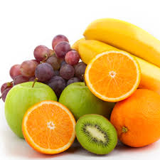

# Food Calories Estimation Using Image Processing

## Nasla 

+ ###  Problem
 The problem can be simply stated as, given a set of food images with calibration object thumb with the food name and an unlabeled set of food images from the same group of 
+ ### Data collection
1. [FOODD](https://drive.google.com/drive/folders/1rmVS_n6P1859trFxKhY7iHVywjTIRYwn?usp=sharing)

>In this project I used 7 food items like apple, banana, carrot, cucumber, onion, orange and tomato which details given in table below
  
  
## Food type

 | Fruits  | Density | Calorie| Label |	Shape   |
 | ------- | ------- | ------ | ----- | --------|
 | Apple   |  0.609  |   52   |   1   | Sphere  | 
 | Banana  |  0.94   |   89   |   2   | Cylinder|
 | Carrot  |  0.641  |   41   |   3   | Cylinder|
 | Cucumber|  0.641  |   16   |   4   | Cylinder|
 | Onion   |  0.513  |   40   |   5   | Sphere  |
 | Orange  |  0.482  |   47   |   6   | Sphere  |
 | Tomato  |  0.481  |   18   |   7   | Sphere  |

